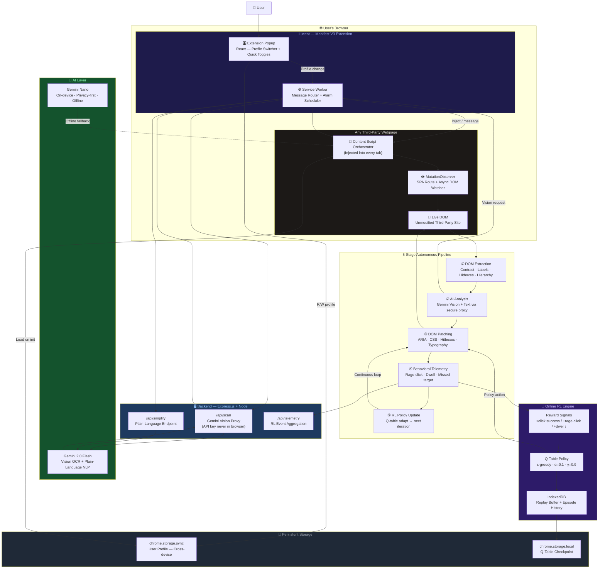
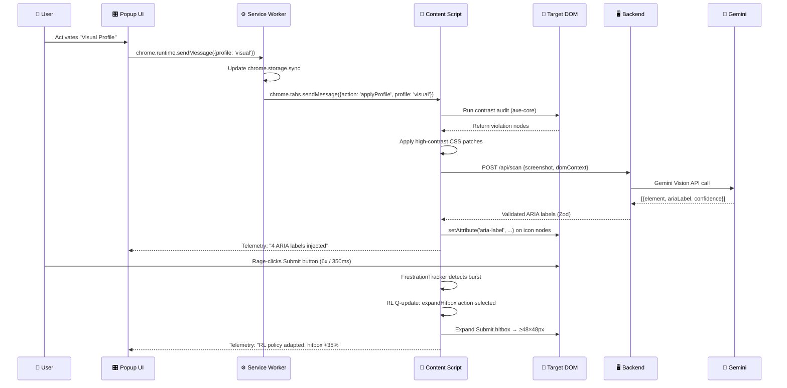
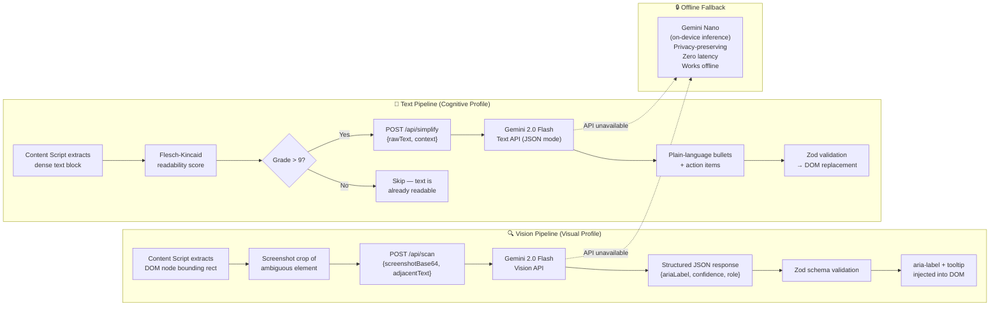
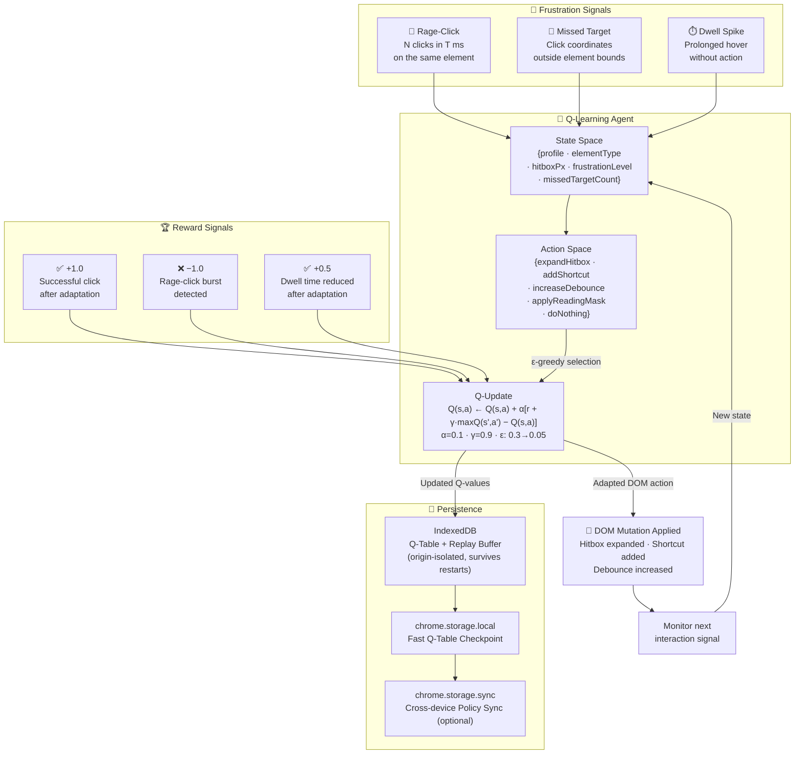
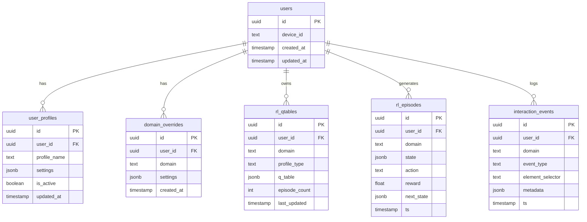
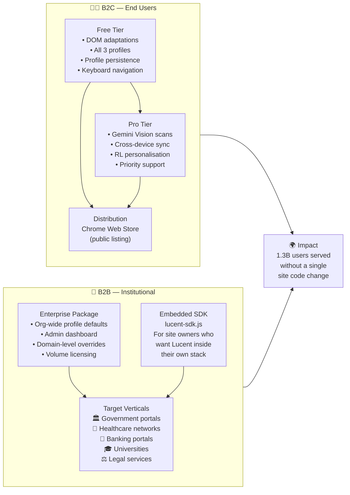

<div align="center">

<!-- LOGO / HERO -->
<br/>

```
██╗     ██╗   ██╗ ██████╗███████╗███╗   ██╗████████╗
██║     ██║   ██║██╔════╝██╔════╝████╗  ██║╚══██╔══╝
██║     ██║   ██║██║     █████╗  ██╔██╗ ██║   ██║   
██║     ██║   ██║██║     ██╔══╝  ██║╚██╗██║   ██║   
███████╗╚██████╔╝╚██████╗███████╗██║ ╚████║   ██║   
╚══════╝ ╚═════╝  ╚═════╝╚══════╝╚═╝  ╚═══╝   ╚═╝   
```

### **The Autonomous, Client-Side Web Accessibility Engine**
#### *Adapts any website, in real-time, for any user — without touching a single line of the site's code.*

<br/>

[](https://react.dev/)
[](https://typescriptlang.org/)
[](https://tailwindcss.com/)
[](https://vitejs.dev/)
[](https://deepmind.google/technologies/gemini/)
[](https://developer.chrome.com/docs/extensions/mv3/)
[](https://www.w3.org/WAI/WCAG22/)

<br/>

> **🏆 Global Innovation Hackathon 2030 · Warner & Spencer**
>
> *Debadrita Bhattacharyya · Reetabrata Mandal · Prathama Biswas · Enaakshi Sen · Tamajit Ghosh · Shreyan Dasgupta*

<br/>

</div>

---

## 📋 Table of Contents

## Local launch and Chrome connection

```bash
npm ci
npm run dev
```

Open `http://localhost:3000`, sign in or enter as a guest, choose either **Cognitive & ADHD** or **Motor & Tremor** support, and use the dashboard to enable just the features required.

To connect the real Chrome extension, open `chrome://extensions`, turn on **Developer mode**, choose **Load unpacked**, and select this repository's `extension` folder. Reload the Lucent dashboard. A Connected status means dashboard changes are being applied to Chrome immediately; browser events are shown in Live activity.

For a production Supabase deployment, run [supabase/schema.sql](supabase/schema.sql) in the Supabase SQL Editor, configure OAuth/email providers in Supabase Auth, then add `VITE_SUPABASE_URL` and `VITE_SUPABASE_PUBLISHABLE_KEY` to the deployment environment. Never commit `.env.local`.

The visual-impairment extension pipeline remains reserved for Tamajit.

- [The Crisis: Why This Exists](#-the-crisis-why-this-exists)
- [The Paradigm Inversion](#-the-paradigm-inversion)
- [The Five-Stage Autonomous Pipeline](#-the-five-stage-autonomous-pipeline)
- [Three Transformation Profiles](#-three-transformation-profiles)
- [System Architecture](#-system-architecture)
- [Strategic Differentiation](#-strategic-differentiation)
- [AI & Intelligence Layer](#-ai--intelligence-layer)
- [The Online RL Feedback Loop](#-the-online-rl-feedback-loop)
- [Database Layer — The Memory of the RL Agent](#️-database-layer--the-memory-of-the-rl-agent)
- [Tech Stack](#️-tech-stack)
- [Repository Structure](#-repository-structure)
- [Go-To-Market](#-go-to-market)
- [Roadmap](#-roadmap)
- [Team](#-team)

---

## 🚨 The Crisis: Why This Exists

<div align="center">

```
╔═══════════════════════════════════════════════════════════════════════╗
║              THE GLOBAL DIGITAL ACCESSIBILITY CRISIS                  ║
╠═══════════════════════════════════════════════════════════════════════╣
║                                                                       ║
║   1,300,000,000 people  ──►  16% of the global population            ║
║   face severe barriers when using digital services                    ║
║                                                                       ║
╠══════════════════╦════════════════════════════════════════════════════╣
║  WCAG AUDIT       ║  96% of the top 1,000,000 websites FAIL          ║
║  REALITY          ║  basic accessibility compliance                   ║
╠══════════════════╬════════════════════════════════════════════════════╣
║  TOP FAILURES     ║  ① Color contrast ratio below 4.5:1 (WCAG AA)   ║
║                   ║  ② Missing alt-text on images and SVG icons      ║
║                   ║  ③ Unlabelled interactive controls               ║
║                   ║  ④ Broken heading hierarchy                      ║
║                   ║  ⑤ Sub-24px click targets (motor failure)        ║
╠══════════════════╬════════════════════════════════════════════════════╣
║  COGNITIVE        ║  Zero WCAG guidance for ADHD, autism,            ║
║  BLINDSPOT        ║  dyslexia, and sensory-overload profiles         ║
╚══════════════════╩════════════════════════════════════════════════════╝
```

</div>

### Why Every Existing Solution Fails

```
┌─────────────────────────────────────────────────────────────────────────┐
│                     EXISTING APPROACHES & THEIR FAILURES                │
├──────────────────────┬──────────────────────────────────────────────────┤
│  PROBLEM             │  ROOT CAUSE                                       │
├──────────────────────┼──────────────────────────────────────────────────┤
│  Developer-Centric   │  Accessibility is treated as a supply-side        │
│  Obligation          │  obligation. Millions of engineering teams must    │
│                      │  individually audit and maintain compliance.       │
│                      │  A fractured, inconsistent ecosystem.             │
├──────────────────────┼──────────────────────────────────────────────────┤
│  Static Screen       │  NVDA/JAWS parse the DOM mechanically.            │
│  Reader Fragility    │  They break entirely on modern SPAs, dynamic      │
│                      │  modals, async content, and unlabelled icon        │
│                      │  libraries — the majority of the modern web.      │
├──────────────────────┼──────────────────────────────────────────────────┤
│  The Cognitive       │  WCAG was written primarily for physical access.  │
│  Blindspot           │  Near-zero guidance for ADHD, autism, dyslexia,   │
│                      │  or sensory overload — the largest underserved    │
│                      │  segment of disabled internet users.              │
├──────────────────────┼──────────────────────────────────────────────────┤
│  Legacy Overlay      │  UserWay, AccessiBe, and similar tools require    │
│  Script Dependency   │  site owners to purchase AND embed a script tag   │
│                      │  on their own server. If they don't install it,   │
│                      │  disabled users remain completely unsupported.     │
└──────────────────────┴──────────────────────────────────────────────────┘
```

---

## 🔄 The Paradigm Inversion

Lucent does not ask web developers to fix their applications. It **moves all remediation logic to the client side**, permanently inverting the accessibility responsibility model.

```
┌─────────────────────────────────────────────────────────────────────────────┐
│                          THE PARADIGM SHIFT                                 │
├─────────────────────────────────┬───────────────────────────────────────────┤
│       TRADITIONAL MODEL         │           THE LUCENT MODEL                │
├─────────────────────────────────┼───────────────────────────────────────────┤
│                                 │                                           │
│   User                          │   User                                    │
│     │                           │     │                                     │
│     ▼                           │     ▼                                     │
│   Broken Third-Party Site ──►   │   Lucent Extension (client-side)          │
│   (96% non-compliant)           │     │                                     │
│     │                           │     │  ① Scans the DOM                    │
│     ▼                           │     │  ② AI analyses ambiguity            │
│   User is excluded              │     │  ③ Patches in real-time             │
│   from digital services         │     │  ④ Learns from user behaviour       │
│                                 │     ▼                                     │
│                                 │   Remediated Site — works for everyone    │
│                                 │   WITHOUT touching the site's code        │
│                                 │                                           │
│   Fix rate: depends on          │   Coverage: 100% of sites the user       │
│   each developer team           │   visits, from day one                   │
└─────────────────────────────────┴───────────────────────────────────────────┘
```

---

## ⚙️ The Five-Stage Autonomous Pipeline

Every time Lucent is active on a page, it runs a continuous 5-stage pipeline that operates silently in the background:

```mermaid
flowchart LR
    A["🌐 Any Target\nWebpage Loaded"] --> B

    subgraph STAGE1["① DOM Extraction"]
        B["MutationObserver\nScans Live DOM"]
        B1["Flags:\n• Low-contrast pairs\n• Unlabelled controls\n• Sub-48px targets\n• Dense text blocks\n• SPA route changes"]
    end
    B --> B1

    subgraph STAGE2["② AI Analysis"]
        C["Gemini 2.0 Flash\nVision + Text"]
        C1["Synthesizes:\n• ARIA labels from icons\n• Alt text for images\n• Plain-language summaries\n• Confidence scores"]
    end
    B1 --> C --> C1

    subgraph STAGE3["③ DOM Patching"]
        D["Non-Destructive\nDOM Mutations"]
        D1["Applies:\n• aria-label / role attrs\n• High-contrast CSS\n• Hitbox expansion\n• Typography reflow"]
    end
    C1 --> D --> D1

    subgraph STAGE4["④ Behavioral Telemetry"]
        E["Frustration Signal\nDetection"]
        E1["Tracks:\n• Rage-clicks (N in T ms)\n• Missed-target coords\n• Dwell time spikes\n• Scroll stalls"]
    end
    D1 --> E --> E1

    subgraph STAGE5["⑤ RL Policy Update"]
        F["Online Q-Learning\nAgent"]
        F1["Adapts:\n• Expand hitboxes\n• Add shortcuts\n• Increase debounce\n• Apply reading mask"]
    end
    E1 --> F --> F1
    F1 -->|"Next page load\nor DOM mutation"| B
```



> **Key property:** The pipeline is **non-destructive** — it never removes or rewrites existing JavaScript event listeners, never breaks the site's functionality, and can be completely reverted to the original state at any time.

---

## 🎯 Three Transformation Profiles

Lucent operates across three distinct impairment pipelines, each with its own detection, AI, and patching logic:

```mermaid
flowchart TD
    USER["👤 User Opens Lucent"] --> SELECTOR["Profile Selector"]
    
    SELECTOR --> VP["👁️ Visual\nImpairment Profile"]
    SELECTOR --> CP["🧠 Cognitive / ADHD\nProfile"]
    SELECTOR --> MP["🖐️ Motor\nImpairment Profile"]
    SELECTOR --> RAW["⚡ Raw\n(No Adaptations)"]

    VP --> V1["Contrast & Color Tuning\nWCAG relative luminance formula\nper text node"]
    VP --> V2["Dynamic Typography Scaling\nFont + icon reflow without\nclipping in fixed containers"]
    VP --> V3["AI Element Labelling\nGemini Vision → bounding-box\ncrop → aria-label injection"]
    VP --> V4["Pixel-Perfect Magnifier\nCanvas-based zoom lens\npointer-events: none overlay"]

    CP --> C1["Sensory De-cluttering\nClassifies & hides banners,\ncarousels, sidebars"]
    CP --> C2["AI Text Synthesis\nFlesch-Kincaid gated →\nGemini plain-language bullets"]
    CP --> C3["Hierarchy Normalisation\nPatches h1–h6 levels;\ninjects form step-markers"]
    CP --> C4["Reading Guide Overlay\nScroll-synced focus band;\npointer-events: none"]
    CP --> C5["Dyslexia Typography\nOpenDyslexic metrics;\nletter-spacing + line-height"]

    MP --> M1["Hitbox Expansion ≥ 48×48px\nCSS min-width/height +\npseudo-element hit area"]
    MP --> M2["Tremor / Steady-Click Filter\nPointermove centroid averaging;\nSettled-click debounce"]
    MP --> M3["Numbered Shortcut Badges\n1–9 overlay badges on\nfocusable elements"]
    MP --> M4["High-Visibility Focus Halo\nLarge animated focus ring\nreplacing default :focus"]
    MP --> M5["Tolerance Windows\nDebounce 150–450ms;\nprevents double-submit"]

    style VP fill:#312e81,color:#a5b4fc
    style CP fill:#2e1065,color:#c4b5fd
    style MP fill:#451a03,color:#fcd34d
    style RAW fill:#1c1917,color:#f87171
```



### Transformation Matrix

<div align="center">

| Capability | 👁️ Visual | 🧠 Cognitive | 🖐️ Motor |
|:---|:---:|:---:|:---:|
| WCAG AAA Contrast Engine | ✅ | — | — |
| Dynamic Font Scale (100–200%) | ✅ | Partial | — |
| AI Vision → ARIA Label | ✅ | — | — |
| Magnifier Overlay | ✅ | — | — |
| Sensory De-cluttering | — | ✅ | — |
| AI Plain-Language Synthesis | — | ✅ | — |
| Heading Hierarchy Normalisation | — | ✅ | — |
| Reading Guide / Focus Mask | — | ✅ | — |
| Dyslexia-Friendly Typography | — | ✅ | — |
| Hitbox Expansion ≥ 48×48px | — | — | ✅ |
| Tremor / Steady-Click Filter | — | — | ✅ |
| Numbered Keyboard Shortcuts | — | — | ✅ |
| High-Visibility Focus Halo | — | — | ✅ |
| Double-Click Debounce | — | — | ✅ |
| **Online RL Personalisation** | ✅ | ✅ | ✅ |
| **MutationObserver (SPA)** | ✅ | ✅ | ✅ |
| **Gemini AI Integration** | ✅ | ✅ | — |

</div>

---

## 🏗️ System Architecture



### Extension Internal Message Flow



---

## ⚔️ Strategic Differentiation

```
┌──────────────────────┬───────────────────────┬──────────────────────┬───────────────────────┐
│     DIMENSION        │   LEGACY OVERLAYS      │  SCREEN READERS      │   LUCENT ENGINE       │
│                      │ (UserWay, AccessiBe)   │  (NVDA, JAWS)        │   (This Project)      │
├──────────────────────┼───────────────────────┼──────────────────────┼───────────────────────┤
│ Installation         │ Server-side script tag │ Separate OS app      │ Browser extension     │
│                      │ by site owner          │ + user config        │ only — no server      │
├──────────────────────┼───────────────────────┼──────────────────────┼───────────────────────┤
│ SPA Compatibility    │ ❌ Breaks on dynamic   │ ❌ Fails entirely    │ ✅ MutationObserver   │
│                      │ route changes          │ on modern SPAs       │ tracks all changes    │
├──────────────────────┼───────────────────────┼──────────────────────┼───────────────────────┤
│ Cognitive Support    │ ❌ Zero                │ ❌ Zero              │ ✅ Full ADHD /        │
│                      │                        │                      │ Autism / Dyslexia     │
├──────────────────────┼───────────────────────┼──────────────────────┼───────────────────────┤
│ AI Intelligence      │ ❌ Static CSS rules    │ ❌ Rigid DOM scan    │ ✅ Gemini 2.0 Flash   │
│                      │ only                   │                      │ Vision + NLP          │
├──────────────────────┼───────────────────────┼──────────────────────┼───────────────────────┤
│ Adaptive Learning    │ ❌ None                │ ❌ None              │ ✅ Online Q-learning  │
│                      │                        │                      │ per user, per site    │
├──────────────────────┼───────────────────────┼──────────────────────┼───────────────────────┤
│ Coverage             │ Only paid-up sites     │ Static/SSR pages     │ ✅ 100% of sites the  │
│                      │                        │ only                 │ user visits           │
├──────────────────────┼───────────────────────┼──────────────────────┼───────────────────────┤
│ Data Privacy         │ DOM sent to vendor     │ Local only           │ ✅ RL is local;       │
│                      │ servers                │                      │ AI via secure proxy   │
└──────────────────────┴───────────────────────┴──────────────────────┴───────────────────────┘
```

---

## 🤖 AI & Intelligence Layer

Lucent uses **Google Gemini 2.0 Flash** for two distinct AI tasks, both gated by validation and fallback logic:



### Why a Backend Proxy?

```
╔═══════════════════════════════════════════════════════════════╗
║              SECURITY: WHY WE USE A BACKEND PROXY             ║
╠═══════════════════════════════════════════════════════════════╣
║                                                               ║
║   ❌  WRONG: Embedding API key in Chrome Extension            ║
║       ┌──────────────┐                                        ║
║       │ content.js   │  ← Key is readable by anyone          ║
║       │ key="AIza..."│    who opens DevTools or decompiles    ║
║       └──────────────┘    the extension package               ║
║                                                               ║
║   ✅  RIGHT: Proxied through our backend                      ║
║       ┌──────────────┐  HTTPS   ┌──────────────┐             ║
║       │ Content      │ ───────► │ Express.js   │             ║
║       │ Script       │          │ Backend      │ ──► Gemini  ║
║       │ (no key)     │          │ (key in env) │    API      ║
║       └──────────────┘          └──────────────┘             ║
║                                  rate limiting                ║
║                                  CORS allowlist               ║
║                                  helmet.js CSP               ║
╚═══════════════════════════════════════════════════════════════╝
```

---

## 🧠 The Online RL Feedback Loop

Lucent's RL engine is a **client-side, zero-dependency TypeScript Q-learner** that personalises the accessibility transformation policy for every individual user, on every website.



### RL Parameters at a Glance

<div align="center">

| Parameter | Value | Meaning |
|:---|:---:|:---|
| Learning Rate `α` | `0.1` | How aggressively the agent updates Q-values on each step |
| Discount Factor `γ` | `0.9` | How much the agent values future rewards vs immediate |
| Exploration `ε` (start) | `0.3` | 30% random exploration initially to discover good policies |
| Exploration `ε` (end) | `0.05` | 5% exploration after 500 interactions — mostly exploitation |
| Reward: Successful click | `+1.0` | Positive reinforcement when adaptation resolves the issue |
| Reward: Rage-click burst | `−1.0` | Negative signal drives policy away from failed strategies |
| Reward: Dwell time reduced | `+0.5` | Partial reward for partial improvement in navigation ease |

</div>

---

## 🗄️ Database Layer — The Memory of the RL Agent

> **Without a persistent database, every session starts cold.** IndexedDB alone is local and ephemeral — cleared when the user wipes browser data or switches devices. Without a durable store, the RL engine can never build the *growing, unique, cross-session personalized recommendations* that make Lucent genuinely intelligent.

### Why Two Storage Tiers?

```
┌────────────────────────────────────────────────────────────────────────────┐
│                      TWO-TIER RL STORAGE STRATEGY                          │
├────────────────────────────────────────────────────────────────────────────┤
│                                                                            │
│   TIER 1 — IN-BROWSER (IndexedDB)          TIER 2 — BACKEND (PostgreSQL)  │
│   ─────────────────────────────────        ──────────────────────────────  │
│   Purpose: Hot reads during a session      Purpose: Durable source of truth│
│   Latency: < 1ms (no network)              Latency: < 5ms (Redis cache)    │
│   Persistence: Until browser data clears   Persistence: Forever            │
│   Cross-device: ❌ No                      Cross-device: ✅ Yes            │
│   Scope: Active tab session only           Scope: All sessions, all devices│
│                                                                            │
│   FLOW:                                                                    │
│   Page loads → fetch Q-table from PostgreSQL (via Redis cache)             │
│             → seed IndexedDB for in-session hot reads                      │
│   Interaction → Q-update in IndexedDB (< 1ms, no network hit)             │
│             → DOM adapted immediately                                      │
│   Every 30s / tab close → sync IndexedDB → PostgreSQL                     │
│   Next session on ANY device → load fresh personalized policy              │
│                                                                            │
└────────────────────────────────────────────────────────────────────────────┘
```

### PostgreSQL Data Model



### What Each Table Does for RL Personalization

| Table | RL Role | Key Fields |
|:---|:---|:---|
| `users` | Identity anchor — links all RL data to one person | `device_id` — anonymous, no auth required for free tier |
| `user_profiles` | Stores the *learned preference profile* per mode | `settings` JSONB grows as RL updates thresholds |
| `domain_overrides` | Per-site profile customisation | User can have different settings for Twitter vs gov portals |
| `rl_qtables` | **The learned policy** — Q-values per `(user × domain × profile)` | `q_table` JSONB: `{ stateHash → { action → qValue } }` |
| `rl_episodes` | **The replay buffer** — full history of `(state, action, reward, next_state)` | Used for offline re-training and policy improvement |
| `interaction_events` | Raw frustration telemetry | `event_type`: `rage_click / missed_target / dwell_spike / success_click` |

### Redis Caching Strategy

```
GET /api/rl/policy?userId=X&domain=Y&profile=visual
      │
      ▼
Redis key: "qtable:{userId}:{domain}:{profile}"
      │
      ├── HIT  → Return Q-table JSON (< 1ms)
      │
      └── MISS → Query PostgreSQL rl_qtables
                 → Cache result in Redis (TTL: 1 hour)
                 → Return Q-table JSON (< 5ms)

POST /api/rl/sync (session end)
      │
      ├── Upsert rl_qtables (updated Q-values)
      ├── Bulk insert rl_episodes
      ├── Bulk insert interaction_events
      └── Invalidate Redis key → next fetch gets fresh policy
```

---

## 🛠️ Tech Stack

<div align="center">

```
┌─────────────────────────────────────────────────────────────────────┐
│                        TECHNOLOGY STACK                             │
├─────────────────────────┬───────────────────────────────────────────┤
│  LAYER                  │  TECHNOLOGIES                             │
├─────────────────────────┼───────────────────────────────────────────┤
│  Extension UI (Popup)   │  React 19 · TypeScript 5 · Tailwind v4   │
│                         │  Motion (Framer) · lucide-react · Vite 8 │
├─────────────────────────┼───────────────────────────────────────────┤
│  State Management       │  Zustand · Zod (schema validation)        │
├─────────────────────────┼───────────────────────────────────────────┤
│  Chrome Extension       │  Manifest V3 · Content Scripts (TS)      │
│                         │  Service Worker · Chrome Storage API      │
│                         │  Chrome Scripting API · MutationObserver  │
├─────────────────────────┼───────────────────────────────────────────┤
│  AI / ML Layer          │  Gemini 2.0 Flash (Vision + Text)        │
│                         │  Gemini Nano (on-device fallback)         │
│                         │  @google/genai SDK · Structured Output    │
├─────────────────────────┼───────────────────────────────────────────┤
│  Online RL Engine       │  Custom TypeScript Q-Agent (zero deps)    │
│                         │  IndexedDB via idb-keyval (hot cache)     │
│                         │  ε-greedy · α=0.1 · γ=0.9               │
├─────────────────────────┼───────────────────────────────────────────┤
│  Database               │  PostgreSQL (durable Q-table + profiles)  │
│  (RL Memory)            │  Prisma ORM (type-safe, auto-migrations)  │
│                         │  Redis + ioredis (server-side hot cache)  │
│                         │  IndexedDB (in-browser session cache)     │
├─────────────────────────┼───────────────────────────────────────────┤
│  WCAG Audit Engine      │  axe-core (WCAG 2.2 AA/AAA)              │
│                         │  Custom WCAG luminance calculator         │
│                         │  Flesch-Kincaid readability scorer        │
├─────────────────────────┼───────────────────────────────────────────┤
│  Backend / API          │  Express.js (TypeScript) · Node 20 LTS   │
│                         │  Helmet.js · express-rate-limit           │
├─────────────────────────┼───────────────────────────────────────────┤
│  Visualisation          │  recharts (RL reward history panel)       │
├─────────────────────────┼───────────────────────────────────────────┤
│  Testing                │  Vitest · Playwright · @testing-library   │
│                         │  axe-playwright (a11y regression)         │
├─────────────────────────┼───────────────────────────────────────────┤
│  CI / CD                │  GitHub Actions · semantic-release        │
│                         │  ESLint · Prettier · Husky + lint-staged  │
└─────────────────────────┴───────────────────────────────────────────┘
```

</div>

---

## 📁 Repository Structure

```
a11ylayer---user-centric-web-accessibility/
│
├── 📄 manifest.json              ← Root MV3 manifest
├── 📄 index.html                 ← Demo shell entry
├── 📄 package.json               ← All dependencies
├── 📄 vite.config.ts             ← Multi-entry build (popup + content + SW + shell)
│
├── 📁 extension/                 ← Chrome Extension source
│   ├── 📄 manifest.json          ← Full MV3 manifest (permissions, CSP, icons)
│   ├── 📁 background/
│   │   ├── service-worker.ts     ← Message router + alarm scheduler
│   │   └── gemini-proxy.ts       ← Backend fetch proxy
│   ├── 📁 content/               ← Injected into every tab
│   │   ├── index.ts              ← Pipeline orchestrator
│   │   ├── spa-observer.ts       ← MutationObserver (SPA-aware)
│   │   ├── contrast-engine.ts    ← WCAG contrast patcher
│   │   ├── aria-injector.ts      ← AI ARIA label injector
│   │   ├── hitbox-expander.ts    ← Motor: ≥48px touch targets
│   │   ├── sensory-filter.ts     ← Cognitive: banner/carousel hider
│   │   ├── hierarchy-normalizer  ← Cognitive: heading repair
│   │   ├── reading-mask.ts       ← Cognitive: scroll focus band
│   │   ├── tremor-filter.ts      ← Motor: steady-click debounce
│   │   ├── keyboard-nav.ts       ← Motor: numbered shortcut badges
│   │   ├── frustration-tracker   ← RL: rage-click + dwell detection
│   │   ├── rl-agent.ts           ← Online Q-learning engine
│   │   └── wcag-auditor.ts       ← axe-core in-content runner
│   └── 📁 popup/                 ← Compact React popup UI
│
├── 📁 src/                       ← Interactive demo shell (web preview)
│   ├── 📁 types/                 ← Domain-split TypeScript types
│   ├── 📁 store/                 ← Zustand state stores
│   ├── 📁 hooks/                 ← Custom React hooks
│   ├── 📁 services/              ← Gemini + WCAG + Storage APIs
│   ├── 📁 lib/                   ← Pure utilities (testable, no React)
│   └── 📁 components/
│       ├── 📁 hud/               ← Extension HUD sub-components
│       ├── 📁 portal/            ← Demo portal sub-components
│       └── 📁 shared/            ← Design system atoms
│
├── 📁 server/                    ← Express.js backend
│   ├── 📁 middleware/            ← helmet, cors, rateLimit, auth
│   └── 📁 routes/                ← /api/scan, /api/simplify, /api/telemetry
│
├── 📁 tests/
│   ├── 📁 unit/                  ← Vitest: lib utilities
│   ├── 📁 integration/           ← Vitest: services
│   └── 📁 e2e/                   ← Playwright: real Chrome + extension
│
└── 📁 .github/workflows/
    ├── ci.yml                    ← PR: lint + typecheck + tests
    ├── e2e.yml                   ← main: Playwright Chrome E2E
    └── release.yml               ← tag: build + zip + GitHub Release
```

---

## 🚀 Go-To-Market



---

## 🗺️ Roadmap

```mermaid
flowchart LR
    P0["Phase 0\n🔧 Foundation\n─────────\nRefactor monoliths\nZustand stores\nESLint + CI setup\nDesign system atoms"]
    P1["Phase 1\n📋 WCAG Engine\n─────────\nReal axe-core\nLive violation count\nInline badges\nContrast calculator"]
    P2["Phase 2\n🤖 Gemini AI\n─────────\nReal vision scan\nText simplification\nZod validation\nNano fallback"]
    P3["Phase 3\n🧠 Online RL\n─────────\nQ-learning agent\nIndexedDB persist\nFrustration tracker\nRL visualisation"]
    P4["Phase 4\n🔌 Extension\n─────────\nMV3 manifest\nContent scripts\nService worker\nExtension popup"]
    P5["Phase 5\n💾 Persistence\n─────────\nchrome.storage\nPer-domain overrides\nProfile import/export\nMulti-site support"]
    P6["Phase 6\n🧪 Testing + CI\n─────────\nVitest unit tests\nPlaywright E2E\nGitHub Actions\nRelease pipeline"]
    P7["Phase 7\n🏢 Production\n─────────\nB2B SDK\nAdmin dashboard\nCWS submission\nSentry monitoring"]

    P0 --> P1 --> P2 --> P3 --> P4 --> P5 --> P6 --> P7

    style P0 fill:#1e1b4b,color:#a5b4fc
    style P1 fill:#1e3a5f,color:#93c5fd
    style P2 fill:#14532d,color:#86efac
    style P3 fill:#2d1b69,color:#c4b5fd
    style P4 fill:#7c2d12,color:#fdba74
    style P5 fill:#064e3b,color:#6ee7b7
    style P6 fill:#1f2937,color:#9ca3af
    style P7 fill:#4c1d95,color:#ddd6fe
```



---

## 👥 Team

<div align="center">

| Name | Role |
|:---|:---|
| **Debadrita Bhattacharyya** | Project Lead & UX Research |
| **Reetabrata Mandal** | AI / ML Architecture |
| **Prathama Biswas** | Chrome Extension Development |
| **Enaakshi Sen** | Frontend & Design System |
| **Tamajit Ghosh** | Backend & API Infrastructure |
| **Shreyan Dasgupta** | WCAG Audit Engine & Testing |

**Hackathon:** Warner & Spencer Global Innovation 2030
**Track:** Inclusive Technology / AI for Social Impact

</div>

---

## 📜 License

```
Apache License 2.0
Copyright 2030 Lucent A11yLayer Team
```

---

<div align="center">

**Built to make the web work for everyone — without asking anyone's permission.**

*"1.3 billion people can't wait for developers to fix their websites.
So we fixed the browser instead."*

</div>
