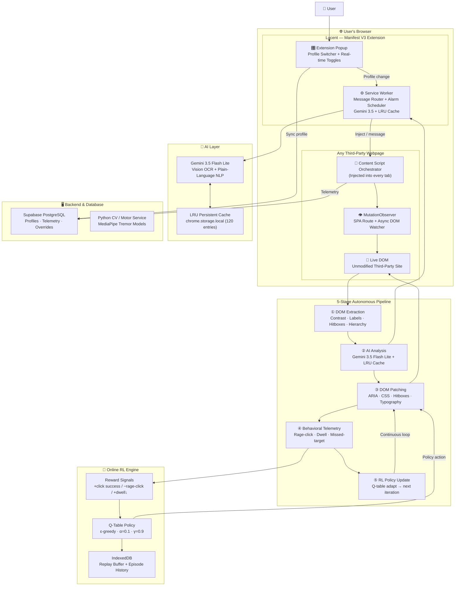
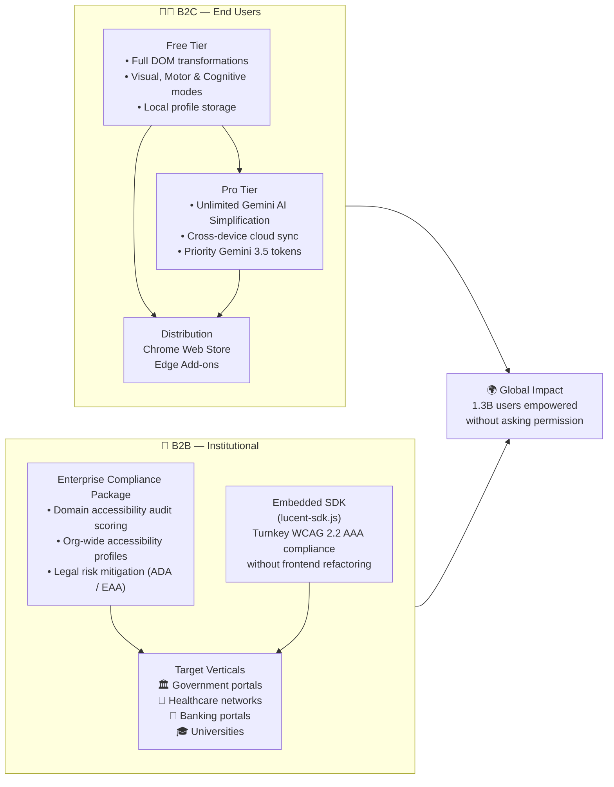

<div align="center">

```
██╗     ██╗   ██╗ ██████╗███████╗███╗   ██╗████████╗
██║     ██║   ██║██╔════╝██╔════╝████╗  ██║╚══██╔══╝
██║     ██║   ██║██║     █████╗  ██╔██╗ ██║   ██║   
██║     ██║   ██║██║     ██╔══╝  ██║╚██╗██║   ██║   
███████╗╚██████╔╝╚██████╗███████╗██║ ╚████║   ██║   
╚══════╝ ╚═════╝  ╚═════╝╚══════╝╚═╝  ╚═══╝   ╚═╝   
```

### **The Autonomous, Client-Side Web Accessibility Engine**
#### *Adapts any website, in real-time, for any user — without touching a single line of the site's code.*

<br/>

[](https://lucent-v3.vercel.app)
[](https://youtu.be/DA1tLGGaov0)
[](https://react.dev/)
[](https://typescriptlang.org/)
[](https://tailwindcss.com/)
[](https://deepmind.google/technologies/gemini/)
[](https://developer.chrome.com/docs/extensions/mv3/)
[](https://www.w3.org/WAI/WCAG22/)

<br/>

> **🏆 Global Innovation Hackathon 2026 · Warner & Spencer**
>
> *Debadrita Bhattacharyya · Reetabrata Mandal · Prathama Biswas · Enaakshi Sen · Tamajit Ghosh · Shreyan Dasgupta*

<br/>

</div>

---

> **🌐 Live Deployed App**: [https://lucent-v3.vercel.app](https://lucent-v3.vercel.app)  
> **📂 GitHub Repository**: [https://github.com/tamajit-ghosh-13/LucentV3](https://github.com/tamajit-ghosh-13/LucentV3)  
> **🎥 Video Walkthrough**: [Watch on YouTube (https://youtu.be/DA1tLGGaov0)](https://youtu.be/DA1tLGGaov0) · `Explanation.mp4`

---

## 📋 Table of Contents

- [⚡ Quick Start for Evaluators](#-quick-start-for-evaluators)
- [🔮 Our Vision & Business Growth](#-our-vision--business-growth)
- [🚨 The Crisis: Why This Exists](#-the-crisis-why-this-exists)
- [🔄 The Paradigm Inversion](#-the-paradigm-inversion)
- [⚙️ The Five-Stage Autonomous Pipeline](#️-the-five-stage-autonomous-pipeline)
- [🎯 Three Transformation Profiles](#-three-transformation-profiles)
- [🏗️ System Architecture](#️-system-architecture)
- [⚔️ Strategic Differentiation](#️-strategic-differentiation)
- [🤖 AI & Intelligence Layer](#-ai--intelligence-layer)
- [🧠 The Online RL Feedback Loop](#-the-online-rl-feedback-loop)
- [🗄️ Database Layer — Memory of the RL Agent](#️-database-layer--the-memory-of-the-rl-agent)
- [🛠️ Tech Stack](#️-tech-stack)
- [📁 Repository Structure](#-repository-structure)
- [🚀 Go-To-Market & Commercialization](#-go-to-market--commercialization)
- [👥 Team](#-team)

---

## ⚡ Quick Start for Evaluators

### 1. 🌐 Live Production Dashboard
Visit **[https://lucent-v3.vercel.app](https://lucent-v3.vercel.app)**:
- Explore the interactive dashboard and profile configurations (**Visual & Low Vision**, **Motor & Tremor**, and **Cognitive & ADHD**).
- Test live accessibility audit scoring, feature toggles, and real-time event telemetry.

### 2. 🧩 Install & Test the Chrome Extension (Live on Any Webpage)
Lucent operates directly inside the browser, transforming third-party websites without requiring site owners to touch their code.
1. Open Google Chrome and navigate to `chrome://extensions/`.
2. Enable **Developer mode** (toggle in the top-right corner).
3. Click **Load unpacked** and select the `extension` folder from this repository (or unzip `public/Lucent-extension.zip`).
4. Open any webpage (e.g., [Wikipedia: Green Lantern](https://en.wikipedia.org/wiki/Green_Lantern) or [BBC News](https://www.bbc.com)).
5. **Try live features**:
   - **Cognitive / AI Simplification**: Highlight any long paragraph, open the Lucent widget (or popup), and click **`✨ Simplify Selected Text`**. Gemini 3.5 Flash Lite condenses it into an instant 1/3-length plain summary with an expandable drawer!
   - **Text-to-Speech (TTS)**: Highlight text and click **Read Aloud** to hear synthesized speech.
   - **Visual Aids**: Toggle High Contrast (Solar, Cyberpunk, Monochrome), Daltonization, Font Scaling, and Hover Magnifiers.
   - **Motor Aids**: Enable Click Smoothing, Target Padding, and Virtual Sticky Anchors.

### 3. 🎥 Watch the Feature Walkthrough Video

[](https://youtu.be/DA1tLGGaov0)

▶️ **[Watch the Full Demo on YouTube (https://youtu.be/DA1tLGGaov0)](https://youtu.be/DA1tLGGaov0)** *(also included offline as `Explanation.mp4`)*.

---

## 🔮 Our Vision & Business Growth

### The Philosophy
Accessibility must not depend on whether a website's developers remembered to implement it. Our vision is to transform web accessibility into an autonomous, client-side human right: an intelligent layer that belongs to the user, understands their individual abilities, and dynamically adapts 100% of the web in real-time.

```
┌─────────────────────────────────────────────────────────────────────────────┐
│                             OUR GROWTH FLYWHEEL                             │
├──────────────────────────────┬──────────────────────────────────────────────┤
│  1. CONSUMER ADOPTION (B2C)  │  Free, zero-friction Chrome extension        │
│                              │  empowering 1.3B disabled users everywhere.  │
├──────────────────────────────┼──────────────────────────────────────────────┤
│  2. DATA & ADAPTATION MOAT   │  Client-side RL continuously learns optimal  │
│                              │  UX accommodations per domain and user.      │
├──────────────────────────────┼──────────────────────────────────────────────┤
│  3. ENTERPRISE VALUE (B2B)   │  Sell compliance telemetry, WCAG risk        │
│                              │  mitigation, and embedded Lucent-SDK to B2B. │
└──────────────────────────────┴──────────────────────────────────────────────┘
```

### 🚀 Upcoming Feature Pipeline
- **🎙️ Multimodal Voice-to-Action Engine**: Complete hands-free website navigation and automated form completion powered by streaming voice intent.
- **🧠 Predictive Cognitive Heatmaps**: Eye-tracking and dwell-time heuristics that preemptively collapse dense clutter before cognitive fatigue or sensory overload triggers.
- **⚡ On-Device Edge SLM (Gemini Nano)**: 100% offline, zero-latency local DOM remediation with total zero-data-leakage privacy.
- **📱 Universal Ecosystem Expansion**: Porting the engine to Safari (macOS/iOS) and Firefox Mobile to bridge the touch-first digital divide.

### 📈 Business & Commercialization Strategy
- **Freemium B2C Model**: Core visual, motor, and cognitive transforms remain free forever. Pro tier introduces unlimited generative AI simplifications and cross-device cloud profile sync.
- **B2B Institutional Compliance & Telemetry**: Enterprises (Fintech, EdTech, Healthcare, Gov) license Lucent for audit reporting, accessibility compliance guarantees, and ADA/EAA legal risk mitigation.
- **Turnkey Embedded SDK (`lucent-sdk.js`)**: A one-line drop-in for enterprise web platforms wanting instant client-side accessibility without massive frontend refactoring.

---

## 🚨 The Crisis: Why This Exists

<div align="center">

```
╔═══════════════════════════════════════════════════════════════════════╗
║              THE GLOBAL DIGITAL ACCESSIBILITY CRISIS                  ║
╠═══════════════════════════════════════════════════════════════════════╣
║                                                                       ║
║   1,300,000,000 people  ──►  16% of the global population            ║
║   face severe barriers when using digital services                    ║
║                                                                       ║
╠══════════════════╦════════════════════════════════════════════════════╣
║  WCAG AUDIT       ║  96% of the top 1,000,000 websites FAIL          ║
║  REALITY          ║  basic accessibility compliance                   ║
╠══════════════════╬════════════════════════════════════════════════════╣
║  TOP FAILURES     ║  ① Color contrast ratio below 4.5:1 (WCAG AA)   ║
║                   ║  ② Missing alt-text on images and SVG icons      ║
║                   ║  ③ Unlabelled interactive controls               ║
║                   ║  ④ Broken heading hierarchy                      ║
║                   ║  ⑤ Sub-24px click targets (motor failure)        ║
╠══════════════════╬════════════════════════════════════════════════════╣
║  COGNITIVE        ║  Zero WCAG guidance for ADHD, autism,            ║
║  BLINDSPOT        ║  dyslexia, and sensory-overload profiles         ║
╚══════════════════╩════════════════════════════════════════════════════╝
```

</div>

### Why Every Existing Solution Fails

```
┌─────────────────────────────────────────────────────────────────────────┐
│                     EXISTING APPROACHES & THEIR FAILURES                │
├──────────────────────┬──────────────────────────────────────────────────┤
│  PROBLEM             │  ROOT CAUSE                                       │
├──────────────────────┼──────────────────────────────────────────────────┤
│  Developer-Centric   │  Accessibility is treated as a supply-side        │
│  Obligation          │  obligation. Millions of engineering teams must    │
│                      │  individually audit and maintain compliance.       │
│                      │  A fractured, inconsistent ecosystem.             │
├──────────────────────┼──────────────────────────────────────────────────┤
│  Static Screen       │  NVDA/JAWS parse the DOM mechanically.            │
│  Reader Fragility    │  They break entirely on modern SPAs, dynamic      │
│                      │  modals, async content, and unlabelled icon        │
│                      │  libraries — the majority of the modern web.      │
├──────────────────────┼──────────────────────────────────────────────────┤
│  The Cognitive       │  WCAG was written primarily for physical access.  │
│  Blindspot           │  Near-zero guidance for ADHD, autism, dyslexia,   │
│                      │  or sensory overload — the largest underserved    │
│                      │  segment of disabled internet users.              │
├──────────────────────┼──────────────────────────────────────────────────┤
│  Legacy Overlay      │  UserWay, AccessiBe, and similar tools require    │
│  Script Dependency   │  site owners to purchase AND embed a script tag   │
│                      │  on their own server. If they don't install it,   │
│                      │  disabled users remain completely unsupported.     │
└──────────────────────┴──────────────────────────────────────────────────┘
```

---

## 🔄 The Paradigm Inversion

Lucent does not ask web developers to fix their applications. It **moves all remediation logic to the client side**, permanently inverting the accessibility responsibility model.

```
┌─────────────────────────────────────────────────────────────────────────────┐
│                          THE PARADIGM SHIFT                                 │
├─────────────────────────────────┬───────────────────────────────────────────┤
│       TRADITIONAL MODEL         │           THE LUCENT MODEL                │
├─────────────────────────────────┼───────────────────────────────────────────┤
│                                 │                                           │
│   User                          │   User                                    │
│     │                           │     │                                     │
│     ▼                           │     ▼                                     │
│   Broken Third-Party Site ──►   │   Lucent Extension (client-side)          │
│   (96% non-compliant)           │     │                                     │
│     │                           │     │  ① Scans the DOM                    │
│     ▼                           │     │  ② AI analyses ambiguity            │
│   User is excluded              │     │  ③ Patches in real-time             │
│   from digital services         │     │  ④ Learns from user behaviour       │
│                                 │     ▼                                     │
│                                 │   Remediated Site — works for everyone    │
│                                 │   WITHOUT touching the site's code        │
│                                 │                                           │
│   Fix rate: depends on          │   Coverage: 100% of sites the user       │
│   each developer team           │   visits, from day one                   │
└─────────────────────────────────┴───────────────────────────────────────────┘
```

---

## ⚙️ The Five-Stage Autonomous Pipeline

Every time Lucent is active on a page, it runs a continuous 5-stage pipeline that operates silently in the background:

```mermaid
flowchart LR
    A["🌐 Any Target\nWebpage Loaded"] --> B

    subgraph STAGE1["① DOM Extraction"]
        B["MutationObserver\nScans Live DOM"]
        B1["Flags:\n• Low-contrast pairs\n• Unlabelled controls\n• Sub-48px targets\n• Dense text blocks\n• SPA route changes"]
    end
    B --> B1

    subgraph STAGE2["② AI Analysis"]
        C["Gemini 3.5 Flash Lite\nVision + Text"]
        C1["Synthesizes:\n• ARIA labels from icons\n• Alt text for images\n• 1/3-length plain summaries\n• LRU cached answers"]
    end
    B1 --> C --> C1

    subgraph STAGE3["③ DOM Patching"]
        D["Non-Destructive\nDOM Mutations"]
        D1["Applies:\n• aria-label / role attrs\n• High-contrast CSS\n• Hitbox expansion\n• Typography reflow"]
    end
    C1 --> D --> D1

    subgraph STAGE4["④ Behavioral Telemetry"]
        E["Frustration Signal\nDetection"]
        E1["Tracks:\n• Rage-clicks (N in T ms)\n• Missed-target coords\n• Dwell time spikes\n• Scroll stalls"]
    end
    D1 --> E --> E1

    subgraph STAGE5["⑤ RL Policy Update"]
        F["Online Q-Learning\nAgent"]
        F1["Adapts:\n• Expand hitboxes\n• Add shortcuts\n• Increase debounce\n• Apply reading mask"]
    end
    E1 --> F --> F1
    F1 -->|"Next page load\nor DOM mutation"| B
```



> **Key property:** The pipeline is **non-destructive** — it never removes or rewrites existing JavaScript event listeners, never breaks the site's functionality, and can be completely reverted to the original state at any time.

---

## 🎯 Three Transformation Profiles

Lucent operates across three distinct impairment pipelines, each with its own detection, AI, and patching logic:


### Transformation Matrix

<div align="center">

| Capability | 👁️ Visual | 🧠 Cognitive | 🖐️ Motor |
|:---|:---:|:---:|:---:|
| WCAG AAA Contrast Engine (Solar/Cyberpunk) | ✅ | — | — |
| Dynamic Font Scale (12–32px) | ✅ | Partial | — |
| AI Vision → ARIA Label & Alt-Text | ✅ | — | — |
| Dynamic Rectangular Hover Magnifier | ✅ | — | — |
| Reading Guide / Focus Mask | — | ✅ | — |
| AI Plain-Language Summaries (1/3 Length) | — | ✅ | — |
| Persistent LRU Simplification Cache | — | ✅ | — |
| Text-to-Speech (TTS) Read Aloud | ✅ | ✅ | — |
| Dyslexia-Friendly Typography | — | ✅ | — |
| Hitbox Expansion ≥ 48×48px | — | — | ✅ |
| Tremor / Steady-Click Centroid Filter | — | — | ✅ |
| Numbered Keyboard Shortcuts | — | — | ✅ |
| Double-Click Debounce Tolerance | — | — | ✅ |
| **Online RL Personalisation** | ✅ | ✅ | ✅ |
| **MutationObserver (SPA Aware)** | ✅ | ✅ | ✅ |
| **Gemini AI Integration** | ✅ | ✅ | — |

</div>

---

## 🏗️ System Architecture



---

## ⚔️ Strategic Differentiation

```
┌──────────────────────┬───────────────────────┬──────────────────────┬───────────────────────┐
│     DIMENSION        │   LEGACY OVERLAYS      │  SCREEN READERS      │   LUCENT ENGINE       │
│                      │ (UserWay, AccessiBe)   │  (NVDA, JAWS)        │   (This Project)      │
├──────────────────────┼───────────────────────┼──────────────────────┼───────────────────────┤
│ Installation         │ Server-side script tag │ Separate OS app      │ Browser extension     │
│                      │ by site owner          │ + user config        │ only — no server      │
├──────────────────────┼───────────────────────┼──────────────────────┼───────────────────────┤
│ SPA Compatibility    │ ❌ Breaks on dynamic   │ ❌ Fails entirely    │ ✅ MutationObserver   │
│                      │ route changes          │ on modern SPAs       │ tracks all changes    │
├──────────────────────┼───────────────────────┼──────────────────────┼───────────────────────┤
│ Cognitive Support    │ ❌ Zero                │ ❌ Zero              │ ✅ Full ADHD /        │
│                      │                        │                      │ Autism / Dyslexia     │
├──────────────────────┼───────────────────────┼──────────────────────┼───────────────────────┤
│ AI Intelligence      │ ❌ Static CSS rules    │ ❌ Rigid DOM scan    │ ✅ Gemini 3.5 Flash   │
│                      │ only                   │                      │ Vision + NLP + Cache  │
├──────────────────────┼───────────────────────┼──────────────────────┼───────────────────────┤
│ Adaptive Learning    │ ❌ None                │ ❌ None              │ ✅ Online Q-learning  │
│                      │                        │                      │ per user, per site    │
├──────────────────────┼───────────────────────┼──────────────────────┼───────────────────────┤
│ Coverage             │ Only paid-up sites     │ Static/SSR pages     │ ✅ 100% of sites the  │
│                      │                        │ only                 │ user visits           │
├──────────────────────┼───────────────────────┼──────────────────────┼───────────────────────┤
│ Data Privacy         │ DOM sent to vendor     │ Local only           │ ✅ RL is local;       │
│                      │ servers                │                      │ On-device cache first │
└──────────────────────┴───────────────────────┴──────────────────────┴───────────────────────┘
```

---

## 🤖 AI & Intelligence Layer

Lucent uses **Google Gemini 3.5 Flash Lite** (with automatic fallback to `gemini-3.6-flash`) for two primary tasks:

1. **Cognitive Plain-Language Simplification**:
   - Analyzes selected paragraphs on demand.
   - Enforces a strict **1/3-length summary constraint** (6th grade reading level).
   - Results are automatically cached in a persistent LRU store (`chrome.storage.local`) keyed by a normalized hash for instant, 0ms, zero-quota re-retrieval.
2. **Autonomous Vision & ARIA Healing**:
   - Evaluates unlabelled controls and images missing alt-text.
   - Generates contextual, descriptive `aria-label` tags and injects them non-destructively into the target DOM.

---

## 🧠 The Online RL Feedback Loop

Lucent's RL engine is a **client-side, zero-dependency TypeScript Q-learner** that personalizes accessibility transformation policy for every user on every domain:

| Parameter | Value | Meaning |
|:---|:---:|:---|
| Learning Rate `α` | `0.1` | How aggressively the agent updates Q-values on each step |
| Discount Factor `γ` | `0.9` | How much the agent values long-term ease vs immediate |
| Exploration `ε` (start) | `0.3` | 30% exploration initially to discover good adaptations |
| Exploration `ε` (end) | `0.05` | 5% exploration after 500 interactions |
| Reward: Successful click | `+1.0` | Positive reinforcement when target is clicked cleanly |
| Reward: Rage-click burst | `−1.0` | Negative penalty for repeated rapid frustration clicks |
| Reward: Dwell time reduced | `+0.5` | Reward for reducing visual scanning friction |

---

## 🗄️ Database Layer — Memory of the RL Agent

Lucent employs a **two-tier memory architecture**:
1. **In-Browser Session Cache (IndexedDB & chrome.storage)**: Hot reads (< 1ms latency) for instant DOM adaptations without network latency.
2. **Durable Cloud Store (Supabase PostgreSQL)**: Stores learned profiles, domain overrides, and interaction history so users keep their accommodations across devices.

---

## 🛠️ Tech Stack

```
┌─────────────────────────────────────────────────────────────────────┐
│                        TECHNOLOGY STACK                             │
├─────────────────────────┬───────────────────────────────────────────┤
│  Frontend Dashboard     │  React 19 · TypeScript 5 · Tailwind CSS v4 │
│                         │  Vite 8 · lucide-react · recharts         │
├─────────────────────────┼───────────────────────────────────────────┤
│  Browser Extension      │  Manifest V3 · Background Service Worker  │
│                         │  Content Scripts · MutationObserver       │
├─────────────────────────┼───────────────────────────────────────────┤
│  AI / LLM Layer         │  Google Gemini 3.5 Flash Lite API         │
│                         │  Persistent Chrome Storage LRU Cache      │
├─────────────────────────┼───────────────────────────────────────────┤
│  Backend & Database     │  Supabase (PostgreSQL Auth & Realtime)    │
│                         │  Python 3.12 (MediaPipe Motor Pipelines)  │
├─────────────────────────┼───────────────────────────────────────────┤
│  Audit Engine           │  axe-core (WCAG 2.2 AAA standard)         │
│                         │  Relative Luminance Contrast Calculator   │
└─────────────────────────┴───────────────────────────────────────────┘
```

---

## 📁 Repository Structure

```text
├── Explanation.mp4             # Complete video walkthrough (YouTube: https://youtu.be/DA1tLGGaov0)
├── README.md                   # Evaluator guide, architecture & submission docs
├── extension/                  # Chrome Extension source (Manifest V3)
│   ├── manifest.json
│   ├── src/
│   │   ├── background/         # Service worker (Gemini 3.5 AI & LRU cache)
│   │   ├── content/            # DOM injection, styles & assistive UI widgets
│   │   └── popup/              # Extension popup controller
│   └── icons/
├── src/                        # React 19 + TypeScript Dashboard source code
│   ├── components/             # Reusable UI & Hackathon announcement banners
│   ├── dashboard/              # Modular accessibility dashboard & telemetry views
│   └── lib/                    # Supabase, Gemini client & Lucent state engine
├── ml_backend/                 # Python computer vision & motor pipelines
├── supabase/                   # Database schema & user preference storage
├── public/                     # Static assets & pre-built Lucent-extension.zip
├── package.json
└── vite.config.ts
```

---

## 🚀 Go-To-Market & Commercialization



---

## 👥 Team

<div align="center">

| Name | Role |
|:---|:---|
| **Debadrita Bhattacharyya** | Project Lead & UX Research |
| **Reetabrata Mandal** | AI / ML Architecture |
| **Prathama Biswas** | Chrome Extension Development |
| **Enaakshi Sen** | Frontend & Design System |
| **Tamajit Ghosh** | Backend & API Infrastructure |
| **Shreyan Dasgupta** | WCAG Audit Engine & Testing |

**Hackathon:** Warner & Spencer Global Innovation 2026  
**Track:** Inclusive Technology / AI for Social Impact  

</div>

---

<div align="center">

**Built to make the web work for everyone — without asking anyone's permission.**

*"1.3 billion people can't wait for developers to fix their websites. So we fixed the browser instead."*

</div>
