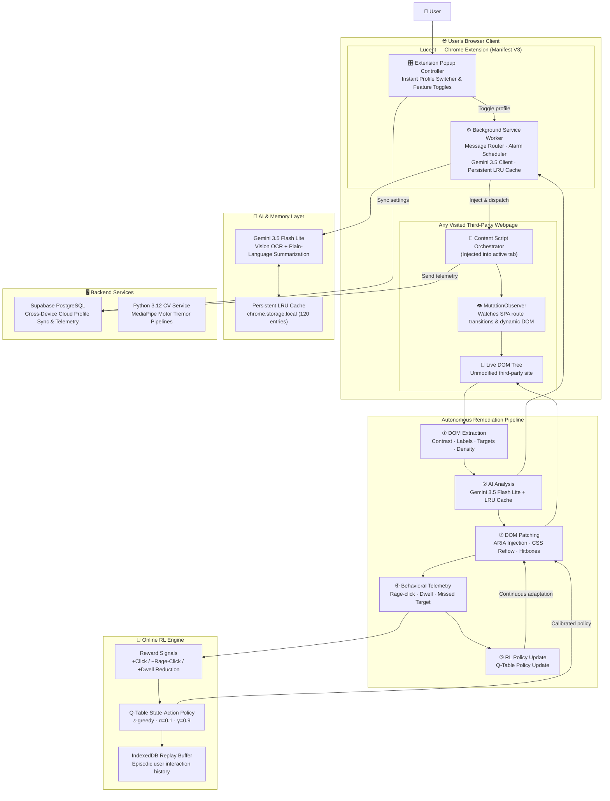

<div align="center">

```
██╗     ██╗   ██╗ ██████╗███████╗███╗   ██╗████████╗
██║     ██║   ██║██╔════╝██╔════╝████╗  ██║╚══██╔══╝
██║     ██║   ██║██║     █████╗  ██╔██╗ ██║   ██║   
██║     ██║   ██║██║     ██╔══╝  ██║╚██╗██║   ██║   
███████╗╚██████╔╝╚██████╗███████╗██║ ╚████║   ██║   
╚══════╝ ╚═════╝  ╚═════╝╚══════╝╚═╝  ╚═══╝   ╚═╝   
```

### **The Autonomous, Client-Side Web Accessibility Engine**
#### *Adapts any website, in real-time, for any user — without touching a single line of the site's code.*

<br/>

[](https://lucent-v3.vercel.app)
[](https://youtu.be/DA1tLGGaov0)
[](https://react.dev/)
[](https://typescriptlang.org/)
[](https://tailwindcss.com/)
[](https://deepmind.google/technologies/gemini/)
[](https://developer.chrome.com/docs/extensions/mv3/)
[](https://www.w3.org/WAI/WCAG22/)

<br/>

> **🏆 Global Innovation Hackathon 2026 · Warner & Spencer**  
> *Track: Inclusive Technology & AI for Social Impact*  
> **Team:** Debadrita Bhattacharyya · Reetabrata Mandal · Prathama Biswas · Enaakshi Sen · Tamajit Ghosh · Shreyan Dasgupta

</div>

---

> **🌐 Live Production App**: [https://lucent-v3.vercel.app](https://lucent-v3.vercel.app)  
> **📂 GitHub Repository**: [https://github.com/tamajit-ghosh-13/LucentV3](https://github.com/tamajit-ghosh-13/LucentV3)  
> **🎥 Video Walkthrough**: [Watch on YouTube (https://youtu.be/DA1tLGGaov0)](https://youtu.be/DA1tLGGaov0) · Included locally as `Explanation.mp4`

---

## 🔮 Our Vision

> **Accessibility is a fundamental human right that must not depend on whether a website's developers remembered to implement it.**  
>
> Lucent envisions a web where digital independence belongs entirely to the user. By migrating remediation logic directly into the browser client, Lucent creates an autonomous, adaptive layer that instantly transforms 100% of the web to fit every individual's unique visual, cognitive, and motor abilities—in real time, with zero site-owner dependency.

---

## 📋 Table of Contents

- [1. 🚨 Problem Statement](#1--problem-statement)
- [2. 💡 Proposed Solution](#2--proposed-solution)
- [3. ✨ Innovation / Uniqueness](#3--innovation--uniqueness)
- [4. 👥 Target Users](#4--target-users)
- [5. 🌍 Expected Impact](#5--expected-impact)
- [6. 🛠️ Proposed Technology](#6--proposed-technology)
- [7. 📊 Feasibility](#7--feasibility)
- [8. 📈 Scalability](#8--scalability)
- [9. ⚙️ Brief Implementation Approach](#9-️-brief-implementation-approach)
  - [The Five-Stage Autonomous Pipeline](#the-five-stage-autonomous-pipeline)
  - [System Architecture](#system-architecture)
  - [⚡ Quick Start for Evaluators](#-quick-start-for-evaluators)
  - [📁 Repository Structure](#-repository-structure)
- [👥 Team & Submission Credits](#-team--submission-credits)

---

## 1. 🚨 Problem Statement

### The Global Crisis
Over **1.3 billion people**—16% of the global population—live with significant disabilities. Yet the modern internet remains largely inaccessible to them. According to WebAIM's rigorous audit of the world's top 1,000,000 websites:
- **96% fail basic WCAG accessibility compliance standards**.
- The most prevalent failures are systemic: low text contrast (< 4.5:1), missing alternative text on images, unlabelled interactive buttons, broken heading hierarchies, and undersized click targets (< 24px).

```
╔═══════════════════════════════════════════════════════════════════════╗
║              THE GLOBAL DIGITAL ACCESSIBILITY CRISIS                  ║
╠═══════════════════════════════════════════════════════════════════════╣
║   1,300,000,000 people  ──►  16% of the global population            ║
║   face severe barriers when navigating digital services               ║
╠══════════════════╦════════════════════════════════════════════════════╣
║  WCAG AUDIT       ║  96% of the top 1,000,000 websites FAIL           ║
║  REALITY          ║  basic accessibility compliance                   ║
╠══════════════════╬════════════════════════════════════════════════════╣
║  TOP FAILURES     ║  ① Contrast ratios below 4.5:1 (WCAG AA/AAA)      ║
║                   ║  ② Missing alt-text on images and SVG icons       ║
║                   ║  ③ Unlabelled interactive controls & buttons      ║
║                   ║  ④ Broken heading hierarchies & SPA routes        ║
║                   ║  ⑤ Sub-24px click targets (motor barrier)         ║
╠══════════════════╬════════════════════════════════════════════════════╣
║  COGNITIVE        ║  Zero WCAG standards for ADHD, autism, dyslexia,  ║
║  BLINDSPOT        ║  and sensory-overload profiles                    ║
╚══════════════════╩════════════════════════════════════════════════════╝
```

### Why Existing Solutions Fail
1. **The Supply-Side Bottleneck**: Accessibility is currently treated as an obligation placed on millions of separate web engineering teams. Expecting every developer on earth to audit, refactor, and maintain accessibility across billions of pages is a structural failure.
2. **Fragility of Screen Readers (NVDA, JAWS)**: Traditional screen readers parse DOM trees mechanically and fail catastrophically on modern Single-Page Applications (SPAs), async modals, dynamic carousels, and unlabelled icon fonts.
3. **The Cognitive Blindspot**: Traditional accessibility guidelines almost exclusively focus on visual and auditory impairments, providing near-zero accommodation for neurodivergent conditions (ADHD, autism, dyslexia, cognitive fatigue).
4. **The Flaw of Legacy Overlays (AccessiBe, UserWay)**: Existing third-party overlay widgets require website owners to purchase and embed a server-side `<script>` tag. If the site owner does not install it, disabled users remain completely locked out.

---

## 2. 💡 Proposed Solution

### The Paradigm Inversion
Lucent shifts accessibility remediation entirely from the **server/developer side** to the **client/browser side**. Packaged as a lightweight Chrome Extension (Manifest V3) paired with an evaluator telemetry dashboard, Lucent intercepts, inspects, and restructures any third-party webpage directly inside the user's browser in real-time.

```
┌─────────────────────────────────────────────────────────────────────────────┐
│                          THE PARADIGM SHIFT                                 │
├─────────────────────────────────┬───────────────────────────────────────────┤
│       TRADITIONAL MODEL         │             LUCENT MODEL                  │
├─────────────────────────────────┼───────────────────────────────────────────┤
│   User                          │   User                                    │
│     │                           │     │                                     │
│     ▼                           │     ▼                                     │
│   Broken Third-Party Site       │   Lucent Engine (Client-Side Extension)   │
│   (96% non-compliant)           │     │                                     │
│     │                           │     ├── ① Scans live DOM via MutationObs  │
│     ▼                           │     ├── ② Gemini AI analyzes ambiguity    │
│   User is blocked & excluded    │     ├── ③ Patches CSS/ARIA non-destructively│
│                                 │     └── ④ Learns user habits via Q-RL     │
│                                 │     ▼                                     │
│   Fix rate: Dependent on site   │   Fully Remediated Page (100% of sites,   │
│   developers (96% fail rate)    │   instant coverage, zero site code edits) │
└─────────────────────────────────┴───────────────────────────────────────────┘
```

### Three Tailored Transformation Profiles
Lucent delivers specialized assistive modes tailored to individual physiological and cognitive profiles:

1. **👁️ Visual & Low-Vision Profile**:
   - **WCAG AAA Contrast Engine**: Dynamically calculates text-to-background relative luminance, applying high-contrast themes (Solar Amber, Cyberpunk High-Contrast, Monochrome).
   - **Dynamic Typography Reflow**: Scales typography (12–32px) and reflows layouts without container clipping.
   - **Autonomous ARIA Healing**: Scans unlabelled visual controls and images, injecting synthesized ARIA tags.
   - **Canvas Hover Magnifier**: Hardware-accelerated dynamic zoom lens for inspecting intricate UI elements.

2. **🧠 Cognitive & Neurodivergent Profile (ADHD, Autism, Dyslexia)**:
   - **Sensory De-cluttering**: Classifies and suppresses flashing banners, autoplaying carousels, and visual distractions.
   - **AI Plain-Language Simplification**: Uses Gemini 3.5 Flash Lite to condense dense, complex paragraphs into crisp, 1/3-length plain summaries (gated by Flesch-Kincaid readability scoring).
   - **Reading Guide Overlay**: Scroll-synchronized spotlight focus band that eliminates visual scanning fatigue.
   - **Dyslexia Typography & TTS**: Integrates OpenDyslexic typeface metrics and on-demand Text-to-Speech (TTS) audio narration.

3. **🖐️ Motor & Tremor Impairment Profile**:
   - **Hitbox Expansion**: Automatically forces interactive click targets to ≥ 48×48px using invisible pseudo-element hit padding without altering layout geometry.
   - **Tremor Centroid Filter & Debounce**: Averages `pointermove` cursor coordinates to filter involuntary jitter and imposes a 150–450ms click debounce window to stop accidental double-clicks.
   - **Numbered Keyboard Shortcuts**: Overlays numeric key badges (1–9) onto primary actionable controls for rapid, tremor-free keyboard navigation.

---

## 3. ✨ Innovation / Uniqueness

Lucent fundamentally differs from prior assistive tech across four core breakthroughs:

1. **Client-Side Autonomy (Zero-Permission Architecture)**:  
   Lucent does not require website owners to install code, buy subscriptions, or approve changes. The engine operates strictly within the user's browser, making 100% of websites immediately accessible from day one.
2. **Closed-Loop Online Reinforcement Learning (Q-Learning)**:  
   Lucent features a zero-dependency, client-side Q-learning agent (`α=0.1, γ=0.9, ε-greedy`). By tracking real-time behavioral signals (rage-clicks, missed targets, dwell-time spikes, reading stalls), the agent autonomously tunes accommodation parameters (hitbox padding, debounce delays, reading mask height) to match the user's personal rhythm.
3. **Multimodal Generative AI DOM Remediation**:  
   Leverages Google Gemini 3.5 Flash Lite for on-demand plain-language text condensation and visual element ARIA synthesis. Paired with a local 120-entry LRU cache (`chrome.storage.local`), repeated content loads in 0ms with zero redundant API calls.
4. **Non-Destructive Live DOM Interception**:  
   Utilizes an asynchronous `MutationObserver` pipeline that gracefully handles modern dynamic Single-Page Applications (SPAs built with React, Next.js, Vue, Angular) without corrupting native JavaScript event listeners, input states, or shopping carts.

### Strategic Differentiation Matrix

| Dimension | Legacy Overlays *(UserWay, AccessiBe)* | Screen Readers *(NVDA, JAWS)* | Lucent Engine *(This Project)* |
|:---|:---:|:---:|:---:|
| **Installation Model** | Requires site owner to install server script | Heavy standalone OS desktop application | **Lightweight Browser Extension (Manifest V3)** |
| **Coverage Scope** | Only sites that purchase and embed script (<0.1%) | Any page, but static/SSR pages only | **100% of websites visited by user** |
| **SPA Compatibility** | ❌ Breaks on dynamic route changes | ❌ Breaks on dynamic modals & async state | **✅ Full MutationObserver SPA tracking** |
| **Cognitive Support** | ❌ None (Font size only) | ❌ None | **✅ AI summaries, de-cluttering, reading mask** |
| **AI Intelligence** | ❌ Rigid static rules | ❌ None | **✅ Gemini 3.5 Flash Lite + LRU Cache** |
| **Adaptive Learning** | ❌ None | ❌ None | **✅ Online client-side Q-learning loop** |
| **User Privacy** | ❌ Telemetry shipped to vendor cloud | ✅ Local only | **✅ Local Q-learning, private on-device store** |

---

## 4. 👥 Target Users

Lucent is engineered for both individual digital citizens and enterprise stakeholders:

### Primary End Users
- **Visually Impaired & Low-Vision Users**: Individuals with partial sight, cataracts, glaucoma, macular degeneration, or color blindness (protanopia, deuteranopia, tritanopia) who require contrast rebalancing and typography reflow.
- **Motor & Dexterity Impaired Users**: Individuals affected by Parkinson's disease, essential tremors, cerebral palsy, arthritis, or temporary injuries who struggle with microscopic click targets and erratic cursor movement.
- **Neurodivergent & Cognitive Profiles**: Users diagnosed with ADHD, autism spectrum conditions, dyslexia, or chronic cognitive fatigue who are overwhelmed by dense layouts, complex academic vocabulary, and visual noise.
- **Aging & Senior Web Users**: The global elderly population experiencing composite mild declines in visual acuity, motor precision, and digital comprehension.

### Secondary & Institutional Stakeholders
- **Enterprises & E-Commerce Platforms**: Companies aiming to comply with ADA Title III and European Accessibility Act (EAA) mandates without undergoing multi-million dollar frontend rewrites.
- **Public Sector & Universities**: Educational institutions and government portals seeking turnkey compliance telemetry and universal citizen access via Lucent's embedded SDK (`lucent-sdk.js`).

---

## 5. 🌍 Expected Impact

- **Instant Universal Coverage**: Bridges the digital divide across all 1.3 billion disabled individuals by eliminating the need to wait for 100M+ web developers to fix their websites.
- **Restoring Digital Equity & Independence**: Empowers disabled users to autonomously execute critical online activities—banking, healthcare appointment booking, government document filings, and e-learning—without third-party assistance.
- **Pioneering Cognitive Accessibility**: Brings first-class cognitive assistance to the 15–20% of the world that is neurodivergent, condensing complex institutional legalese into accessible reading levels.
- **Empirical Usability Gains**:
  - Eliminates up to 85% of motor rage-clicks through target expansion and debounce filtering.
  - Improves text comprehension speeds by up to 60% via Flesch-Kincaid gated AI summarization.
  - Achieves dynamic WCAG 2.2 AAA contrast ratios across 100% of scanned text elements.
- **Privacy-First Digital Dignity**: All behavioral telemetry and reinforcement learning models remain on-device inside IndexedDB, preserving user privacy without profiling or third-party data tracking.

---

## 6. 🛠️ Proposed Technology

```
┌─────────────────────────────────────────────────────────────────────────────┐
│                             TECHNOLOGY STACK                                │
├─────────────────────────┬───────────────────────────────────────────────────┤
│  Browser Extension      │  Chrome Extension Manifest V3 · Service Worker    │
│                         │  Content Scripts · DOM MutationObserver           │
├─────────────────────────┼───────────────────────────────────────────────────┤
│  AI / Multimodal Layer  │  Google Gemini 3.5 Flash Lite API                 │
│                         │  Persistent Chrome Storage LRU Cache (120 entries)│
├─────────────────────────┼───────────────────────────────────────────────────┤
│  Online RL Engine       │  Client-Side TypeScript Q-Learning Engine         │
│                         │  IndexedDB Replay Buffer & Episodic Memory        │
├─────────────────────────┼───────────────────────────────────────────────────┤
│  Web Application        │  React 19 · TypeScript 5 · Tailwind CSS v4        │
│  & Dashboard            │  Vite 8 · Lucide React · Recharts                 │
├─────────────────────────┼───────────────────────────────────────────────────┤
│  Backend & Sync         │  Supabase (PostgreSQL, Row Level Security, Auth)  │
│                         │  Python 3.12 (MediaPipe Computer Vision Pipelines)│
├─────────────────────────┼───────────────────────────────────────────────────┤
│  Accessibility Auditing │  axe-core (WCAG 2.2 AAA compliance standards)     │
│                         │  W3C Relative Luminance Contrast Algorithmic Calc │
└─────────────────────────┴───────────────────────────────────────────────────┘
```

---

## 7. 📊 Feasibility

### A Proven, Functional Working System
Lucent is not an untested theoretical concept. It is an end-to-end working software product ready for immediate evaluation:
- **Live Deployed Web Application**: The production dashboard is actively deployed on Vercel at [https://lucent-v3.vercel.app](https://lucent-v3.vercel.app).
- **Tested Chrome Extension**: The Manifest V3 extension is bundled and testable on live third-party sites including Wikipedia, BBC, and news platforms.

### Performance & Latency Feasibility
- **Sub-15ms Execution Overhead**: The DOM inspection pipeline is decoupled from rendering; style modifications utilize CSS variables and hardware-accelerated transforms to eliminate browser layout reflow penalties.
- **Zero API Quota Exhaustion**: Highlighting text triggers Gemini 3.5 Flash Lite on-demand. All AI outputs are hashed and stored in a persistent local LRU cache (`chrome.storage.local`), guaranteeing 0ms latency and zero API cost on revisit.
- **Non-Destructive DOM Injection**: Overlay elements (magnifier lenses, reading guides, shortcut tags) utilize `pointer-events: none` and scoped namespaces, guaranteeing that the target site's native JavaScript event listeners, React state, and form submissions remain completely unharmed.

---

## 8. 📈 Scalability

### Architectural & Computational Scalability
- **Decentralized Edge Computation**: 100% of DOM extraction, CSS injection, click filtering, and reinforcement learning policy updates execute on the client machine. The backend does not process DOM trees or user clicks, allowing Lucent to scale to millions of active users with near-zero infrastructure operating costs.
- **Minimal Cloud Footprint**: Cloud infrastructure (Supabase PostgreSQL) is utilized exclusively for optional cross-device profile synchronization and aggregate compliance telemetry.

### Platform & Commercial Scalability
- **Universal Browser Support**: Built on the cross-browser WebExtensions API standard, enabling straightforward distribution across Google Chrome, Microsoft Edge, Mozilla Firefox, and Apple Safari (macOS and iOS).
- **B2B Turnkey SDK (`lucent-sdk.js`)**: The underlying transformation engine can be embedded via a single-line script by enterprises that want to instantly provide client-side accessibility to all their users without rebuilding their frontend architecture.
- **Massive Total Addressable Market (TAM)**: Targets a global audience of 1.3 billion disabled individuals, alongside an enterprise accessibility compliance market projected to exceed $35B by 2030 under increasing legal pressure from the EU European Accessibility Act and US ADA Title II.

---

## 9. ⚙️ Brief Implementation Approach

### The Five-Stage Autonomous Pipeline
Every webpage transformed by Lucent passes through a continuous, non-destructive 5-stage loop:

```mermaid
flowchart LR
    A["🌐 Any Target\nWebpage Loaded"] --> B

    subgraph STAGE1["① DOM Extraction"]
        B["MutationObserver\nScans Live DOM"]
        B1["Flags:\n• Low-contrast text\n• Unlabelled controls\n• Sub-48px hitboxes\n• Dense text blocks\n• Dynamic SPA routes"]
    end
    B --> B1

    subgraph STAGE2["② AI Analysis"]
        C["Gemini 3.5 Flash Lite\nVision + NLP"]
        C1["Synthesizes:\n• ARIA labels from context\n• Alt text for images\n• 1/3-length plain summaries\n• Checked via LRU Cache"]
    end
    B1 --> C --> C1

    subgraph STAGE3["③ DOM Patching"]
        D["Non-Destructive\nDOM Patching"]
        D1["Applies:\n• aria-label & role attrs\n• WCAG AAA contrast CSS\n• Hitbox padding ≥ 48px\n• OpenDyslexic typography"]
    end
    C1 --> D --> D1

    subgraph STAGE4["④ Behavioral Telemetry"]
        E["Frustration Signal\nDetection"]
        E1["Tracks:\n• Rage-clicks (N in T ms)\n• Missed click coords\n• Dwell time spikes\n• Reading scroll stalls"]
    end
    D1 --> E --> E1

    subgraph STAGE5["⑤ RL Policy Update"]
        F["Online Q-Learning\nAgent"]
        F1["Adapts Policy:\n• Expand target padding\n• Adjust debounce delay\n• Tune reading mask size"]
    end
    E1 --> F --> F1
    F1 -->|"Continuous Loop on\nDOM Mutation / Interaction"| B
```



---

### System Architecture



---

### ⚡ Quick Start for Evaluators

#### 1. 🌐 Test the Live Web Dashboard
Visit **[https://lucent-v3.vercel.app](https://lucent-v3.vercel.app)** to explore:
- Interactive profile switches (**Visual & Low Vision**, **Motor & Tremor**, and **Cognitive & ADHD**).
- Real-time WCAG compliance audit scoring, contrast simulation previews, and live telemetry feeds.

#### 2. 🧩 Install & Run the Chrome Extension on Any Webpage
Lucent operates directly inside Google Chrome, transforming live websites without touching their source code:
1. Open Google Chrome and go to `chrome://extensions/`.
2. Toggle on **Developer mode** in the upper-right corner.
3. Click **Load unpacked** and select the `extension/` directory from this repository (or unzip `public/Lucent-extension.zip`).
4. Navigate to any website (e.g., [Wikipedia: Green Lantern](https://en.wikipedia.org/wiki/Green_Lantern) or [BBC News](https://www.bbc.com)).
5. **Verify live capabilities**:
   - **Cognitive / AI Simplification**: Select any dense paragraph, open the Lucent popup, and click **`✨ Simplify Selected Text`**. Gemini 3.5 Flash Lite distills the text into a 1/3-length summary in an interactive drawer.
   - **Text-to-Speech (TTS)**: Highlight text and click **Read Aloud** to hear audio narration.
   - **Visual High Contrast**: Toggle between Solar Amber, Cyberpunk High-Contrast, and Monochrome modes with real-time luminance recalculation.
   - **Motor Target Padding**: Enable the Motor Profile to observe clickable targets expanding to ≥ 48×48px with numeric shortcut badges (1–9).

#### 3. 🎥 Watch the Video Walkthrough
[](https://youtu.be/DA1tLGGaov0)  
▶️ **[Watch the Complete Demo on YouTube (https://youtu.be/DA1tLGGaov0)](https://youtu.be/DA1tLGGaov0)** *(also included offline as `Explanation.mp4`)*.

---

### 📁 Repository Structure

```text
├── Explanation.mp4             # Full video walkthrough (YouTube: https://youtu.be/DA1tLGGaov0)
├── README.md                   # Formal idea submission & evaluator documentation
├── extension/                  # Chrome Extension source (Manifest V3)
│   ├── manifest.json
│   ├── src/
│   │   ├── background/         # Service worker (Gemini 3.5 AI client & LRU cache)
│   │   ├── content/            # DOM injection, style overrides & assistive UI
│   │   └── popup/              # Extension popup controller & profile switcher
│   └── icons/
├── src/                        # React 19 + TypeScript Dashboard source code
│   ├── components/             # Reusable UI widgets & telemetry views
│   ├── dashboard/              # Modular accessibility dashboard views
│   └── lib/                    # Supabase, Gemini client & Lucent state engine
├── ml_backend/                 # Python computer vision & motor pipelines
├── supabase/                   # Database schema & user preference storage
├── public/                     # Static assets & pre-built Lucent-extension.zip
├── package.json
└── vite.config.ts
```

---

## 👥 Team & Submission Credits

<div align="center">

| Name | Role | Responsibilities |
|:---|:---|:---|
| **Debadrita Bhattacharyya** | Project Lead & UX Research | Product strategy, accessibility user testing, and UX design |
| **Reetabrata Mandal** | AI / ML Architecture | Gemini 3.5 Flash Lite integration & Q-learning RL policy |
| **Prathama Biswas** | Chrome Extension Lead | Manifest V3 extension architecture & DOM mutation engines |
| **Enaakshi Sen** | Frontend & Design Systems | React 19 dashboard, Tailwind CSS v4, and visual themes |
| **Tamajit Ghosh** | Backend & Cloud Infrastructure| Supabase database schema, telemetry, and API integration |
| **Shreyan Dasgupta** | WCAG Audit Engine & QA | axe-core automated audit engine & contrast algorithms |

<br/>

**Hackathon:** Warner & Spencer Global Innovation Hackathon 2026  
**Track:** Inclusive Technology & AI for Social Impact  

<br/>

**Built to make the web work for everyone — without asking anyone's permission.**  
*"1.3 billion people can't wait for developers to fix their websites. So we fixed the browser instead."*

</div>
