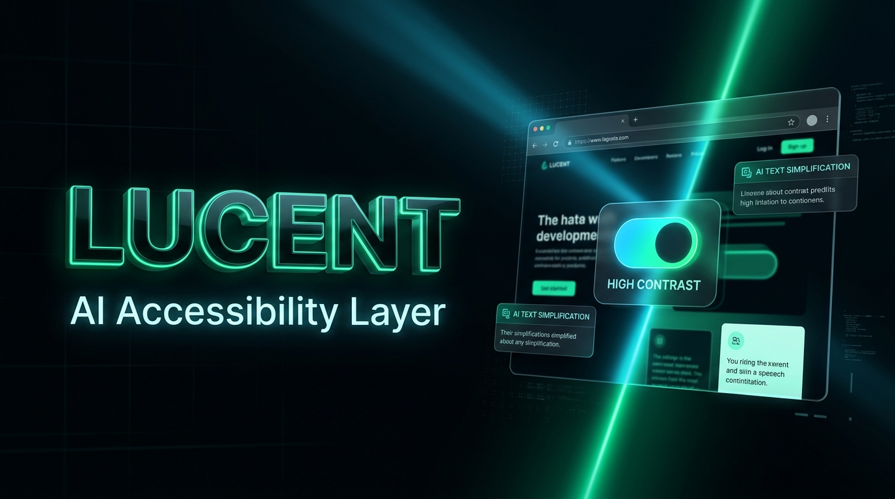

<div align="center">

```
██╗     ██╗   ██╗ ██████╗███████╗███╗   ██╗████████╗
██║     ██║   ██║██╔════╝██╔════╝████╗  ██║╚══██╔══╝
██║     ██║   ██║██║     █████╗  ██╔██╗ ██║   ██║   
██║     ██║   ██║██║     ██╔══╝  ██║╚██╗██║   ██║   
███████╗╚██████╔╝╚██████╗███████╗██║ ╚████║   ██║   
╚══════╝ ╚═════╝  ╚═════╝╚══════╝╚═╝  ╚═══╝   ╚═╝   
```

### **The Autonomous, Client-Side Web Accessibility Engine**
#### *Adapts any website, in real-time, for any user — without touching a single line of the site's code.*

<br/>

[](https://react.dev/)
[](https://typescriptlang.org/)
[](https://tailwindcss.com/)
[](https://vitejs.dev/)
[](https://deepmind.google/technologies/gemini/)
[](https://developer.chrome.com/docs/extensions/mv3/)
[](https://www.w3.org/WAI/WCAG22/)

<br/>

> **🏆 Global Innovation Hackathon 2026**
>
> *Debadrita Bhattacharyya · Reetabrata Mandal · Prathama Biswas · Enaakshi Sen · Tamajit Ghosh · Shreyan Dasgupta*

<br/>

</div>

---

# 🌟 Lucent — Submission & Evaluator Guide

> **Live Deployed App**: [https://lucent-v3.vercel.app](https://lucent-v3.vercel.app)  
> **GitHub Repository**: [https://github.com/tamajit-ghosh-13/LucentV3](https://github.com/tamajit-ghosh-13/LucentV3)  
> **Video Walkthrough**: [Watch on YouTube (https://youtu.be/DA1tLGGaov0)](https://youtu.be/DA1tLGGaov0) · `Explanation.mp4`  

---

## ⚡ Quick Start for Judges (3 Ways to Experience Lucent)

### 1. 🌐 Live Production Dashboard
Visit **[https://lucent-v3.vercel.app](https://lucent-v3.vercel.app)**:
- Explore the interactive dashboard and profile configurations (**Visual & Low Vision**, **Motor & Tremor**, and **Cognitive & ADHD**).
- Test the live accessibility audit scoring, feature toggles, and real-time event telemetry.

---

### 2. 🧩 Install & Test the Chrome Extension (Live on Any Webpage)
Lucent operates directly inside the user's browser, modifying third-party websites without requiring site owners to change their code.

1. Open Google Chrome and navigate to `chrome://extensions/`.
2. Enable **Developer mode** (toggle in the top-right corner).
3. Click **Load unpacked** in the top-left corner.
4. Select the `extension` folder included in this submission package.
5. Open any website (e.g., [Wikipedia: Green Lantern](https://en.wikipedia.org/wiki/Green_Lantern) or [BBC News](https://www.bbc.com)).
6. **Try the features live**:
   - **Cognitive / AI Simplification**: Highlight any long paragraph with your mouse, open the Lucent widget (or popup), and click **`✨ Simplify Selected Text`**. Gemini AI will instantly condense it into a clean, 1/3-length plain summary right on the page with an expandable drawer!
   - **Text-to-Speech (TTS)**: Highlight text and click **Read Aloud** to hear natural speech synthesis.
   - **Visual Aids**: Toggle High Contrast (Solar, Cyberpunk, Monochrome), Color-Blind Simulators, Font Scaling, Reading Guides, and Hover Magnifiers.
   - **Motor Aids**: Enable Click Smoothing, Target Padding, and Virtual Sticky Anchors.

*(Alternatively, the ready-to-use archive is also available at `public/Lucent-extension.zip`)*.

---

### 3. 🎥 Watch the Feature Walkthrough Video
Watch our complete feature walkthrough, live demonstrations, and architectural overview:

[](https://youtu.be/DA1tLGGaov0)

▶️ **[Click here to watch on YouTube (https://youtu.be/DA1tLGGaov0)](https://youtu.be/DA1tLGGaov0)**  
*(Also available offline as `Explanation.mp4` in the root of the project package).*

---

## 💻 Running the Dashboard Locally (Optional)

If you wish to run the full dashboard codebase locally:

```bash
# 1. Install dependencies
npm install

# 2. Run the Vite development server
npm run dev

# 3. Open in browser
# http://localhost:3000
```

---

## 🏗️ Submission Directory Structure

```text
├── Explanation.mp4             # Video walkthrough (YouTube: https://youtu.be/DA1tLGGaov0)
├── README.md                   # Evaluator guide, architecture & submission docs
├── extension/                  # Chrome Extension source (Manifest V3)
│   ├── manifest.json
│   ├── src/
│   │   ├── background/         # Service worker (Gemini 3.5 AI & LRU cache)
│   │   ├── content/            # DOM injection, styles & assistive UI widgets
│   │   └── popup/              # Extension popup controller
│   └── icons/
├── src/                        # React 19 + TypeScript Dashboard source code
├── ml_backend/                 # Python computer vision & motor pipelines
├── supabase/                   # Database schema & user preference storage
├── public/                     # Static assets & pre-built Lucent-extension.zip
├── package.json
└── vite.config.ts
```

---
*Created for the Global Innovation Hackathon · Team Lucent*
